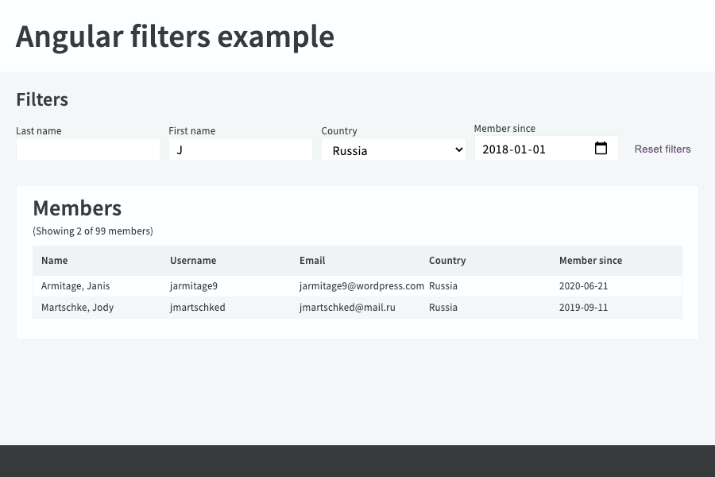

# Angular 10 filters

This project uses custom pipes to filter data.

## Angular version

This project was generated with [Angular CLI](https://github.com/angular/angular-cli) version 10.0.4.

## Build and run

Install dependencies by running:

<pre>
yarn install
</pre>

Then run a dev server:

<pre>
ng serve
</pre>

To preview, navigate to:

<pre>
http://localhost:1234/
</pre>

(Server port can be changed in angular.json.)

## Filters implementation

Data filtering is implemented using custom pipes (see <code>src/app/pipes/</code>).

There are examples of using these pipes in
<code>src/app/pages/members-page/members-page.component.html</code> (to filter data) as well as
<code>src/app/pages/members-page/members-page.component.ts</code> (to get the number of filtered items).
For the pipes to be accessible in the typescript file, they were added to the list of providers in
<code>src/app/app.module.ts</code>.
